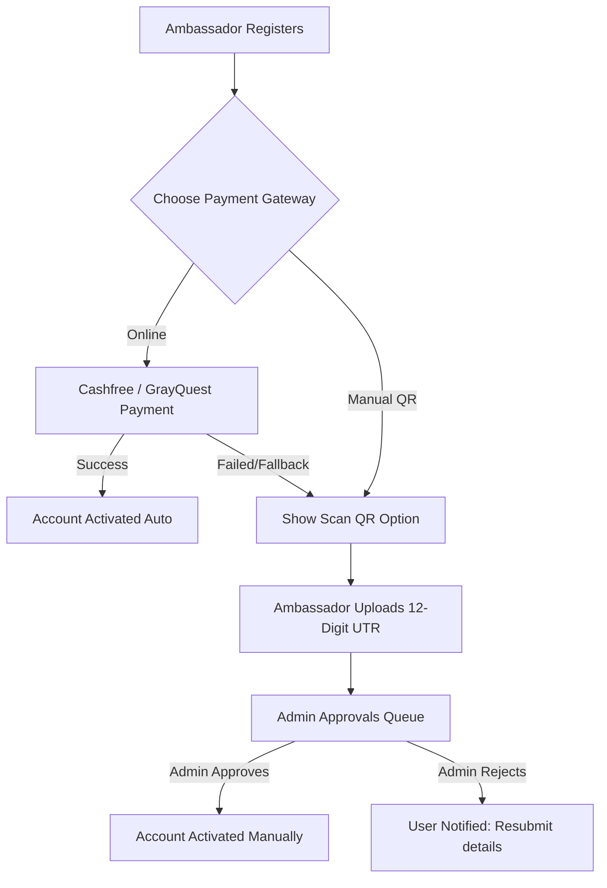
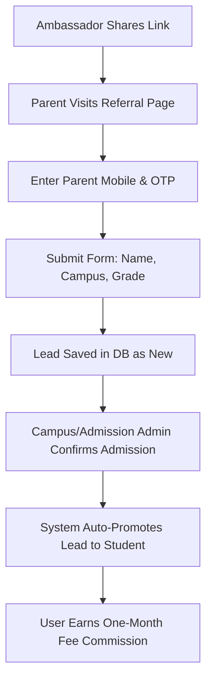
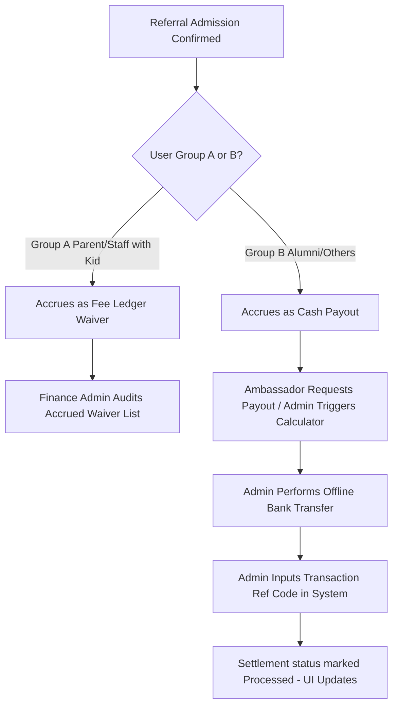

# Heguru Partnership Program (HPP) — Roles, Tasks, & Operational Procedures Guide

This guide provides a comprehensive overview of all user roles, their features, main tasks, and specific step-by-step procedures in the Heguru Partnership Application.

---

## 👥 1. User Roles Matrix

### Ambassador (Partner) Roles
Ambassadors refer students and earn rewards based on their role and child enrollment status.

*   **Parent**: Parents of current or prospective students.
*   **Staff**: Academic or administrative staff members of the institution.
*   **Alumni**: Ex-students of the institution.
*   **Others**: General public ambassadors.

> [!NOTE]
> **Group A (Waiver Group)**: `Parent` or `Staff` who have an active child enrolled in the school (`childInAchariya: true`). Their commission earnings are credited as **Applied Fee Waivers** on their child's school ledger.
> **Group B (Payout Group)**: `Alumni`, `Others`, or `Parent`/`Staff` without an active child currently enrolled (`childInAchariya: false`). Their commissions are processed as **Direct Cash Payouts** to their bank accounts.

---

### Administrative Roles
Administrators manage the application, verify entries, audit data, and process payouts.

*   **Super Admin**: Holds full global system capabilities (access control, global settings, audit logs, database maintenance).
*   **Finance Admin**: Focuses on managing membership payments, verifying offline QR receipts, managing cash payouts, and auditing Group A waivers.
*   **Campus Head**: Assigned to a specific campus; monitors campus targets, local student enrollments, and support tickets.
*   **Campus Admin**: Handles campus-specific data entry, lead management, and local student master directories.
*   **Admission Admin**: Manages the incoming referral lead pipeline and checks parent-child enrollment verifications.

---

## ⚙️ 2. Core Workflows & Procedures

### Workflow A: Membership Registration & Fee Collection
When a new Ambassador signs up, they must pay a ₹25 membership fee to activate their dashboard.

#### Detailed Procedure:
1.  **User Step**: The ambassador completes registration and lands on the payment gateway page.
2.  **Payment Processing**:
    *   **Online**: Payment is routed to Cashfree or GrayQuest. If successful, webhook alerts (`/api/payment/webhook` or `/api/payment/grayquest/webhook`) trigger a server action that updates status to `SUCCESS` and flags user as `Active`.
    *   **Offline Fallback**: If the online transaction fails, a fallback QR code modal displays. The ambassador transfers ₹25 via UPI, inputs the 12-character transaction ID (UTR), and submits. Their status becomes `Pending` with paymentStatus as `Pending Approval`.
3.  **Administrative Approval**:
    *   **Who**: **Finance Admin** or **Super Admin**.
    *   **Where**: Accesses the `/superadmin/approvals` queue.
    *   **How**: Reviews the uploaded transaction ID. If legitimate, clicks **Approve**. If not, clicks **Reject** and inputs a reason (e.g., "Invalid UTR").
4.  **Status Sync**:
    *   *If Approved*: The system atomically updates the payment database record to `SUCCESS`, flags the user account status to `Active`, calculates initial benefit metrics, and updates dashboard metrics.
    *   *If Rejected*: Enters status `FAILED` in the database, resets user `paymentStatus` to `Rejected`, and fires an in-app notification mapping the rejection reason back to the user's dashboard (prompting them to re-verify UTR).

---

### Workflow B: Making and Processing a Student Referral
How referrals are entered, verified, and admitted into the school system.

#### Detailed Procedure:
1.  **Lead Capture**:
    *   **Link Flow**: A prospective parent clicks the ambassador's short link `/r/[code]` which redirects to `/refer?ref=code`. Redirection shows the Ambassador's name in a golden greeting card. For anti-spam verification, the verification OTP is routed to the referred *Ambassador* (who must coordinate with the parent).
    *   **Direct Flow**: The parent goes directly to `/refer` without an invite code. Redirection is bypassed, and verification OTP goes directly to the parent's phone.
    *   **Offline Mode**: If network connectivity is lost, the form caches details into browser IndexedDB, saving leads locally until connection is re-established.
2.  **Admission Action**:
    *   **Who**: **Admission Admin**, **Campus Admin**, or **Campus Head**.
    *   **Procedure**: When the parent visits the campus and pays school fees, the admin locates the lead in `/admin?view=referrals`. Clicking **Confirm** prompts for their school Admission Number, Fee Type (OTP - One Time Payment or WOTP - Without One Time Payment), and fee amounts collected.
3.  **Commission Trigger**:
    *   The system updates `leadStatus` to `Confirmed`/`Admitted` and promotes the lead by writing an active student record into the `Student` table.
    *   The system triggers stats updates, recalculating commission structures. The ambassador immediately sees their new lead move from the **Pre-Asset** queue to the **Asset** queue on their dashboard.

---

### Workflow C: Commission Calculation & Payout Settlement
Reconciling ambassador commissions (direct payouts vs. ledger fee waivers).

#### Detailed Procedure:
1.  **Accrual**: 
    *   Each confirmed admission generates a reward equal to **one-month fee** (Annual Fee divided by 12).
    *   *Group A (Waiver)*: Accrues in `liabilities_a` as Applied Credits.
    *   *Group B (Cash Payout)*: Accrues in `liabilities_b` as Pending Payouts.
2.  **Payout Execution**:
    *   **Who**: **Finance Admin** (under `/finance`) or **Super Admin** (under `/superadmin?view=settlements`).
    *   **Procedure**:
        1.  The admin runs the **Settlement Calculator Modal** to audit outstanding balances.
        2.  The admin logs into the institution's bank portal and transfers the calculated payout amount directly to the ambassador's registered bank account (or applies waivers directly to the school ledger).
        3.  The admin clicks **New Settlement Request**, selects the user, and inputs the payout amount.
        4.  In the pending settlements list, the admin clicks **Process**, enters the bank reference code (UTR) and payout date, and saves.
3.  **Dashboard Update**:
    *   The settlement record updates status to `Processed`.
    *   The balance is deducted from the Ambassador's "Pending Balance" and added to "Paid Settlements" (or "Applied Credits" for waiver users).
    *   The change is updated inside the ambassador's **My Earnings** ledger and **Transaction History** tables.

---

### Workflow C.2: Group A Waiver Redemption & Accounting Flow
This workflow describes how Parent/Staff ambassadors with children enrolled in Achariya redeem their **1-Month Course Fee Discount**.

#### 1. How the Calculation Happens
*   **Trigger**: When an ambassador's referral is marked as `Confirmed` or `Admitted` by the admin.
*   **Formula**: 
    $$\text{One-Month Discount} = \text{round}\left(\frac{\text{Annual Course Fee of Referred Student}}{12}\right)$$
*   **Fee Determination**:
    *   The system uses the actual annual fee entered by the admin during lead confirmation (`annualFee`).
    *   If the fee field is left blank, it automatically references the `GradeFee` lookup table matching the **referred student's campus, grade, and academic cycle** (e.g. `2026-2027`).
*   **Accrual**: The calculated amount is added to the parent's accrued slab rewards pool (`slabShare` in codebase logic). It is displayed as a pending waiver liability under the `liabilities_a` (Waiver Group A) list in the admin panel.

#### 2. Responsibility for Processing
*   The **Finance Admin** (or Super Admin) is responsible for auditing, matching, and executing waiver applications.
*   The **Campus Head** monitors the ledger entries to ensure children assigned to their campus receive correct credit marks.

#### 3. Step-by-Step Redemption Procedure
1.  **Administrative Audit**: The Finance Admin opens the `/finance` panel and navigates to the **Liabilities - Group A (Waiver)** (`liabilities_a`) tab. They locate the parent's record and note the outstanding waiver balance.
2.  **Offline Ledger Posting**: The Finance Admin accesses the school's central ERP/fees bookkeeping software. They post a credit voucher (equivalent to the outstanding waiver amount) directly against the upcoming fee installments of the ambassador's child.
3.  **Record as Settled**:
    *   The admin returns to the partnership portal, launches the **Settlement Calculator Modal**, selects the parent, and clicks **New Settlement Request** for the waiver amount.
    *   The admin goes to the pending settlements list, clicks **Process**, and logs the **Credit Voucher ID** as the `bankReference` along with the transaction date.
4.  **Reflection in Ambassador Portal**:
    *   On the ambassador's **My Earnings** page, the amount is shifted out of **Pending Balance** and listed under **Applied Credits** inside the primary balance hero card.
    *   A new line-item is appended to their **Transaction History** ledger marked as type `WAIVER` with a status of `Processed`, showing the corresponding school credit voucher number.
    *   Inside their **Pipeline Management** (`/referrals`) view, the specific referred student's card is updated with a blue `Settled` tag.

---

### Workflow D: Parent Beneficiary Verification
Verification checks to prevent abuse of the Group A fee-waiver discount.

#### Detailed Procedure:
1.  **User Step**: During registration, a Parent or Staff member declares their child is in Achariya (`childInAchariya: true`) and provides their child's Name, Grade, and Admission Number (EPR No).
2.  **Suggested Matching**:
    *   **System Action**: The application searches database tables (`Student` master table and the pre-uploaded `ErpStudentData` staging tables) for matching parent mobile numbers or EPR numbers.
3.  **Review Queue**:
    *   **Who**: **Super Admin** (under `/superadmin/verification`).
    *   **Procedure**: Checks the pending verification list. Suggested matching records show up as green (matched in main database) or blue (matched in ERP staging data). If unassigned, the user's campus and grade fields pull suggestion values automatically to correct errors.
4.  **Promotion Decision**:
    *   *Approve*: The admin clicks approve. The system creates a Student profile in the database, maps it to the parent user ID, and updates the parent's status to `Active`. It applies the **one-child-only** discount rule (first verified child gets `yearFeeBenefitPercent` discount on fees, subsequent children get 0% discount).
    *   *Reject*: The admin enters a rejection reason. The user is flagged `Inactive` in the benefit database and receives an inbox alert linking them back to correct their registration details.

---

## 🛠️ 3. Role-by-Role Features & Procedures

### Super Admin
*   **Access Control**: Navigates to Access Control tab (`/superadmin?view=permissions`) to toggle checkboxes for individual permissions across all system roles.
*   **System Configuration**: Navigates to Settings (`/superadmin?view=settings`) to modify registration toggles, gateway selectors (Cashfree vs. GrayQuest), and referral message templates.
*   **CSV Import Utilities**: Opens bulk upload modal to import massive files for Students, Users, Fee Configurations, and CRM leads.
*   **Audit Trail logs**: Navigates to `/superadmin?view=audit` to inspect global logging histories of all administrative operations.

### Finance Admin
*   **Reconciliations**: Accesses the `/finance` panel. Uses search filter grids to reconcile registrations, ready refunds, payout liabilities, and history ledgers.
*   **Manual Payments Queue**: Accesses payment approvals to verify manual QR receipts, approving/rejecting transaction proofs.
*   **Settlement Processing**: Reconciles waiver credits and triggers settlement payouts.

### Campus Head & Campus Admin
*   **KPI Tracking**: Monitors conversions, ambassador counts, and campus performance indicators.
*   **Target Definitions**: Opens targets modal (`/campus/target-modal`) to assign monthly target parameters for lead count and admission volume.
*   **Student Registry**: Reviews and edits local student data profiles, or adds direct "organic" student records.

### Admission Admin
*   **Leads Pipeline**: Accesses referral pipelines to review incoming leads and update contact statuses (Contacted, Follow-up, Confirmed).
*   **Verification Review**: Inspects candidate verifications and suggested matches.
