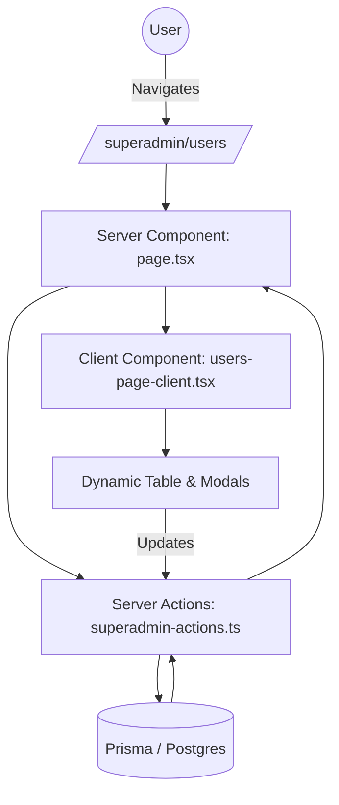

# Architecture Overview

## Unified Admin Experience

The project has recently undergone an "Admin Experience Unification" to streamline management and improve performance.

### From Monolithic Panels to Route-Based Components

Previously, the Admin and Superadmin interfaces relied on large, monolithic "Panel" components (e.g., `UserPanel.tsx`, `StudentPanel.tsx`) that handled all logic and rendering in a single client-side file. This was difficult to maintain and led to large bundle sizes.

We have transitioned to a **Route-Based Server Component** architecture:

1.  **Layout & Routing**: Admin functionality is now organized into logical sub-routes within `src/app/(main)/superadmin/` and `src/app/(main)/admin/`.
2.  **Server Components**: Each page (e.g., `/superadmin/users/page.tsx`) is a Next.js Server Component. It fetches data directly using Server Actions (`getAllUsers`, `getAllStudents`, etc.).
3.  **Parallel Data Fetching**: We utilize `Promise.all` in Server Components to fetch all necessary data (users, campuses, stats) in parallel, significantly reducing page load times.
4.  **Client Components**: Heavy interactivity (modals, forms, status updates) is delegated to lean "Client Components" (e.g., `users-page-client.tsx`), which receive pre-fetched data as props.

### Data Flow

### Key Benefits
- **Better SEO**: Important metadata is rendered on the server.
- **Improved Performance**: Smaller client-side JavaScript bundles.
- **Maintainability**: Clear separation of concerns between data fetching (Server) and UI logic (Client).
- **Security**: Database logic and secret keys stay on the server.
